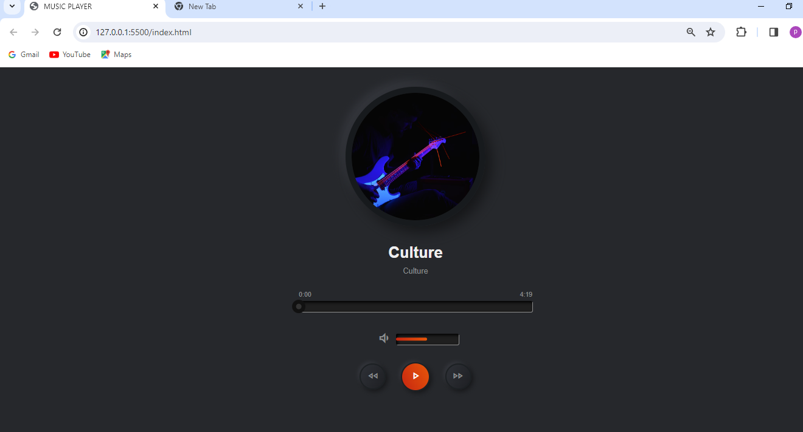
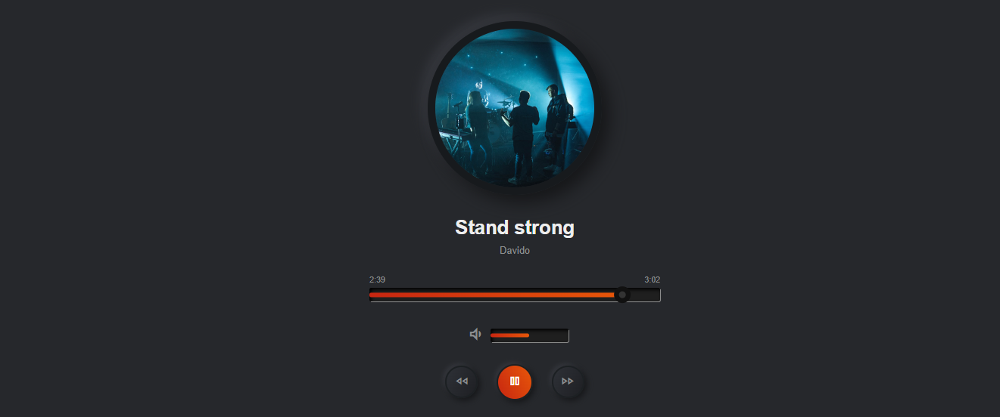
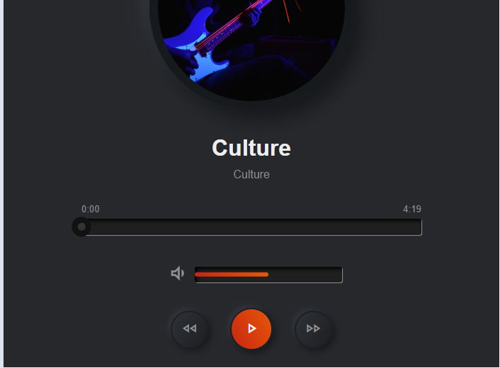
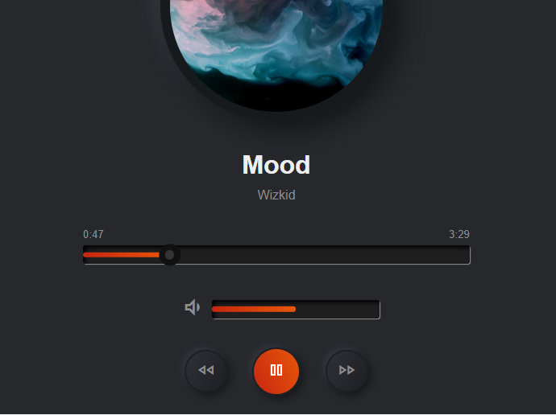

# THIS IS MY FINAL PROJECT FOR WEB3 FRONTEND DEVELOPER FOR BEGINNERS. 
## This project was developed using HTML, CSS AND JAVASCRIPT. 
## THE PROJECT IS A SIMPLE MUSIC PLAYER WHICH ALLOWS A USER TO BE ABLE TO DO SOME BASIC STUFFS IN THE APP.
### THE DESKTOP VIEW OF THE APP .

### WHEN A MUSIC IS PLAYING IN DESKTOP .

### MAX WIDTH OF 700PX FOR MEDIA QUERY

### WHEN A MUSIC IS PLAYING IN MOBILE.

## DEVELOPED BY NOBLE AHORLU 
## THANKS TO WEB3 FOR THE OPPORTUNITY TO STUDY IN THE BEGINNERS COHORT.

# END OF MY README. THANKS